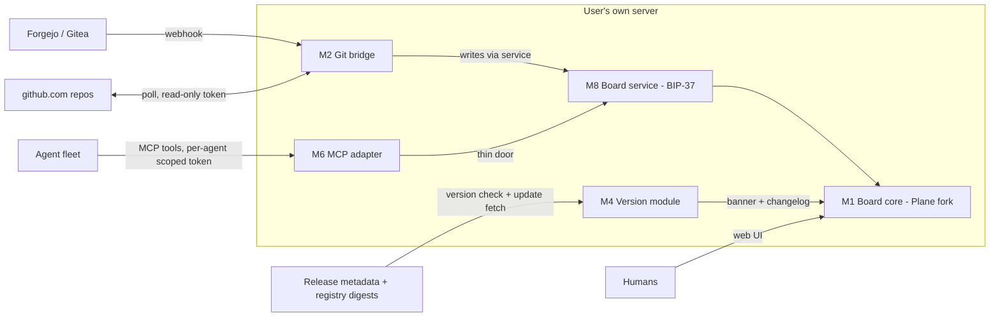

# Biplane — Scope-A Architecture (re-begin design)

**Status:** REWRITTEN 2026-08-12 after the implementation audit. M5 (update channel)
replaced; invariants 8 and 9 added; review ledgers removed (git history holds them).
Supersedes the merged base + amendments 1-3. · **Author:** Aria
**Decision owner:** John — author≠merger trust rule RATIFIED 2026-08-11 evening

---

## 1. Purpose

Biplane's goal, set by John 2026-08-11: **a superset of paid Plane on the axes a
self-hosting team actually uses**, on top of the agent/git layer Plane does not have.
This document is the master plan. Every future BIP in this effort must point at a
module and interface below. If work doesn't fit this document, either the work is
wrong or this document gets amended first — no silent drift.

**Scope A (this document):** update channel, MCP access for agents, Gitea support,
ticket↔PR linking completion, version identity, and the board service they expose
the need for (M8).
**Scope B (explicitly out):** Plane AI / Wiki / dashboards / time tracking /
marketplace — expected later as SB skills, not Biplane modules. Also out: GitLab
adapter (future feature, John 2026-08-11), two-way GitHub *issue* sync.

## 2. System context



Everything runs on the user's server. There are **three bounded outbound
operations**, each fail-safe, and none of them is a fixed number of HTTP
requests — an earlier revision said "exactly three calls", which was neither a
request count nor a stable operation count once M5 specified a release API plus
an asset with redirect hops (Morrow, RC 3407; the same cardinality defect one
section above where it was already fixed):

- **the version check** (M5) — release API plus the `release.json` asset, with
  redirect hops sharing one size and wall-clock budget; unreachable, malformed
  or incomparable ⇒ **UNKNOWN**, never "up to date";
- **the update apply** (M5) — registry image pulls **by digest**, verified by
  content address on pull; a substituted image fails to pull rather than
  starting;
- **the forge poller** (M3) — unprovable gaps stay retryable, never silently
  skipped.

**Sequencing note (from review):** M6 v1 may ride the existing public API — with
identity bound at the write boundary, which is live today — ONLY as an explicitly
interim door, and only with the M6 restrictions below. It is not the destination.
The destination is M8; transition rules are advisory today and become enforced
only when M8 lands.

## 3. Modules

| # | Module | State | Work |
|---|--------|-------|------|
| M1 | Board core (Plane fork) | live | no structural change |
| M2 | Git bridge | live, verified | MOD: write boundary (all board/state writes REFUSED; completion rule, target resolution and backlink DELETED) + scope guard |
| M3 | Forge adapters | **LANDED** — #16, #17, #18 all merged; forge personalities, per-forge delivery auth and payload accessors are on main | enable Gitea; harden the adapter contract |
| M4 | Version module | PR #38 MERGED (BIP-43). Gap: no installed semantic version, only a build id | add `biplane_installed_version` |
| M5 | Update channel | does not exist | NEW |
| M6 | MCP adapter | does not exist | NEW (interim door until M8) |
| M7 | Write-path (identity + audit) | live | unchanged |
| M8 | Board service (BIP-37) | does not exist | NEW — the real enforcement home |

### M2 — Git bridge (modify)

**Reference grammar (lexically closed — Morrow 3278):**

- **Directive form is an anchored trailer line, not free text:** `Closes BIP-N`
  or `Refs BIP-N` — start of line, own line. **Colon optional** (7of9 3281: the
  anchor delivers lexical closure; mandating the colon would silently orphan
  the fleet's trained colon-less habit and the merged guide — BIP-33 at fleet
  scale). **"Own line" means END-ANCHORED (Vex 3289): the directive must match
  the entire line, trailing whitespace only. A line with any other content is
  not a directive, whether the extra content precedes or follows the keyword** —
  `Closes BIP-7 once CI is green` is natural English for "not done yet" and
  must never complete. Case-insensitive keyword, exactly one ticket per line,
  multiple lines allowed.
- **One location rule (Rowan 3285):** directives are RECOGNIZED in exactly two
  places — a pull request's **body**, and a commit's **complete message text,
  subject line and body alike** — same anchored form, same ignored contexts
  everywhere. Completion EXECUTES only from a PR-body directive on a merge
  event; every other (location, event) combination advances at most.
  **"Titles never carry directives" is about the PULL REQUEST title, and it
  says nothing about a commit subject.** The commit message is ONE field: it is
  split into lines and every line is a candidate, so a subject that is exactly
  `Closes BIP-N` is a directive. Saying "commit message bodies" was wrong about
  the code and wrong about the habit — a one-line commit has no body, and that
  is the shape most likely to carry a trailer.
- **Ignored contexts, pinned by adversarial tests:** quoted lines (`> …`),
  fenced code blocks, HTML comments, any inline occurrence (`do not closes
  BIP-7`, changelog fragments), and **leading directives with trailing prose**
  (`Closes BIP-7 once CI is green`) — none of these are directives.
  **Terminal-punctuation verdict (7of9 3293, decided-in-corpus):** a single
  terminal `.` or `!` is tolerated (`Closes BIP-7.` completes — the period
  changes no meaning); ANY other trailing content disqualifies, and a
  disqualified near-miss is recorded loudly in the delivery result under the
  durable key **`ignored.near_misses`** (a list of the offending lines), never
  silently inert.
- **Duplicates and conflicts are reduced PER EVENT, not per source.** Duplicate
  directives are idempotent; if one event carries both `Closes` and `Refs` for
  the same ticket, the weaker (`Refs`) wins and the conflict is recorded in the
  delivery result. **A push is one event however many commits it carries**, so
  `Closes BIP-N` in one commit and `Refs BIP-N` in another is a conflict, and a
  ticket named in two commits is ONE candidate. Both the candidate and the
  conflict are **exactly one fact each**, produced before the event's class
  downgrade rather than after it — reduce after the downgrade and the classes
  have already been made uniform, so there is nothing left to compare and a
  broken implementation looks correct. *(Spec was right and the code was not:
  reduction ran per parse until 2026-08-15, so cross-commit conflicts were never
  recorded and duplicates were hidden downstream by result-level dedupe.)*
- **The accepted spellings are these EIGHT, and no others** (John ruled the
  complete class in, 2026-08-11 — GitHub habit beats strictness). Singular and
  plural of each verb, because both are written in practice:

  | class | accepted spellings |
  |---|---|
  | **advance** | `ref` · `refs` |
  | **complete** | `close` · `closes` · `fix` · `fixes` · `resolve` · `resolves` |

  **No past tense.** `closed`, `fixed`, `resolved` are NOT keywords, in either
  class — past tense in a commit message describes what the commit did, not what
  the event asks of a ticket, and a message narrating its own history must not
  select one. The keyword is matched case-insensitively; the ticket identifier is
  **uppercase-only**. Bare `(BIP-N)` anywhere stays deliberately inert.

  This list is ONE map, `grammar.KEYWORD_CLASS`, and there is now ONE anchored
  admission policy behind it: `forward_selection` delegates to
  `parse_directives`, so push, merge and review paths all recognise the same
  thing. (The ruling that produced the shared map, Morrow 2026-08-14, was
  written when a second unanchored matcher existed and the two could differ on
  where a directive may appear. That matcher is deleted with its last caller —
  the shared map remains, the divergence it guarded against cannot recur.)

- **What a keyword does, exactly: it SELECTS a ticket and PROPOSES a class.** It
  never authorises anything. Under the ruling below, authority comes from
  verified facts and never from author-supplied text, so the class is an input
  to a proposed effect — read every row of the matrix that way.

  | event | what a recognised directive proposes |
  |---|---|
  | `push` | advance — **complete-class DOWNGRADES to advance.** Nothing completes without a merged pull request. |
  | merged pull request | advance, or completion from a PR-body directive |
  | **review requesting changes** | **neither — the class is irrelevant once the ticket is selected.** The event proposes *ask the responsible participant for rework*, and there is no board write in it at all. A changes-requested review is not a merge and not an approval, so no directive in it can ever complete or advance a ticket; selection is the only thing the grammar contributes. |

  There is deliberately **no advance-target rule here any more.** An earlier
  revision specified which state `Refs` resolves to on merge. That rule was a
  board-state decision made by the bridge, which is precisely what the ruling
  below withdrew, and it outlived the writes it governed. What a ticket moves to
  is the responsible role's decision; when the write half returns it will be
  specified with its caller, not inherited from here.

### Who may move a ticket — John's ruling, 2026-08-14

Supersedes forward-only, the ingress caveat, and every board-shaped guard this
document previously proposed.

**Roles move tickets. In any direction.** The agent responsible for a ticket
moves it as work progresses or regresses; a reviewer closes it or sends it back;
anyone entitled may drop it to Backlog. A board that cannot go backwards does not
reflect the work.

**The bridge is a TOOL, not an actor.** It has no role and no authority at all.
Every write it makes is made on behalf of a participant and is recorded as
theirs — the question is never "may the bridge do this" but "did someone do
something this tool is carrying out". A ticket reaching Done because a pull
request merged is the merger's action; the activity entry names them.

**Humans and agents rule. Bots assist.** A bot exists to save the people doing
the work from bookkeeping — it never rules over them, and it never decides
anything they have not already decided. Everything below is the bridge *saving
someone a step*, not the bridge being granted a power.

**What the bridge does for you, and when.** It moves the ticket you would have
moved yourself, once the work plainly says so. All of the following, each read
from its own
authoritative source and **re-read at the moment of the write**. There is no
single authority here and saying "verified from the forge" was wrong (Morrow):
**the forge owns what happened to the code; the board owns who is responsible for
the work.**

| fact | authority |
|---|---|
| the pull request merged | **forge** |
| who approved, and their review state | **forge** |
| the ticket's Reviewer(s) | **board** |
| the ticket names this pull request | **board** |
| a forge account ↔ a board participant | **neither, yet** |

**That last row is the one with no owner, and it is load-bearing.** Checking
"the ticket's Reviewers approved" means joining an actor the FORGE supplies to a
participant the BOARD supplies. **Both ENDPOINTS of that join exist; the join
itself does not.**

- **The forge end exists and is deliberately strict** (slice 2, built for
  exactly this attribution). A merged pull request's `author` and `merged_by`
  are hydrated and stored as a provider `id` **plus** `login`
  (`github_events._actor_of`, `poller._actor_payload`), with three
  distinguishable outcomes: an absent field RAISES rather than being recorded as
  a measured absence, a malformed or id-less actor RAISES, and an explicit null
  is stored as the measured "the provider named nobody". **The id is the
  identity; the login is display.** Logins rename and get reused, so a login
  alone cannot support the author-exclusion rule — the rule must know *who*.
- **The board end exists**: participants, with the ticket's Reviewer(s) named
  against them (policy today, schema later — see the status block).
- **Nothing maps one to the other.** A first attempt (ADR 011 Instance 3) was
  built and then REMOVED from this release: it had no caller, and its shape
  could not distinguish the same login on two different forges — which is the
  same defect the actor coordinate above is shaped to avoid.

So the completion path needs a third fact beside the binding and the reviewer
set. It is not "no identity evidence exists" — the evidence is collected,
strictly, and refuses to guess. What is missing is the correspondence that turns
a verified forge actor into a board participant. Recorded here rather than left
for whoever implements completion to discover at the join.

(Separately, and not the same thing: the synthetic actor the bridge once used as
the AUTHOR of its own board writes is gone, removed with the writes. That was a
writer identity, never attribution evidence, and its removal took nothing the
join needs.)

1. The pull request **merged**.
2. **Two or more** approving reviews from participants named in the ticket's
   **Reviewer(s)** field — a field on the ticket, recorded like the author, set
   like assignee by whoever is coordinating the work. **This field does not
   exist yet: no model, no migration, no serializer, no API.** The requirement is
   normative and stays here so the completion path is designed against it; the
   schema lands with its own narrow API slice (see the status block).
3. The pull request's **author is excluded** from that count, as is the ticket's
   author. Two people looked at it, and neither is the person who wrote it.
4. **The ticket names the pull request.** This is the match, and it is required —
   not a convenience. We already keep it by hand as the `[code: #NN]` card
   annotation; it becomes a field the bridge reads. **Also absent today** — which
   is why `decide_completion` returns `BINDING_UNAVAILABLE` unconditionally
   rather than evaluating anything.

**Author-supplied text selects, it never authorises.** `Closes BIP-12` in a body
or commit message says *which* ticket an event concerns and nothing more. Only
text the directive grammar recognises may nominate a ticket; titles stay inert.

**Anything else: it hands the work back to a person.** Not because it is
forbidden to act — because it does not know, and guessing on someone's behalf is
the one thing an assistant must never do. A review requesting
changes, a missing or unmatched ticket, an unreadable reviewer field — the
bridge notifies the participant holding the relevant role and keeps notifying
until the ticket moves. **The asking is the more valuable half of this service.**
*(That sentence is the POLICY. What of it runs today is stated exactly in the
Status block below — the in-app notification half and recurrence are not in
this release.)*

**Why not a board-state rule.** Every protection expressible in board state can
be withdrawn by an ordinary board action — reopen a ticket and a stray directive
completes it — and unstarted → completed must stay legitimate, because that is
how ordinary work completes. Authority comes from the actor and the verified
event, or from nothing (Sable).

**Why nothing heavier.** We were designing against an adversary and there is no
adversary: the incident behind this was a documentation example read as an
instruction. Guarding accidents is a smaller problem than guarding sabotage, and
a guard sized for the wrong threat model is a bill this project has already paid
(John: *"This is a team, not a public free-for-all. Friendly coordination, not
policing at every move."*).

**Status: the refusing half runs; the writing half does not.** Stated exactly,
because an earlier version of this paragraph said "none of this runs yet" while
the notification caller was already live — the source/spec contradiction this
train exists to eliminate, committed inside the paragraph that reports status.

- **Every BOARD/STATE write is off** — completion and advance alike, and the
  backlink comment with them — and the bridge keeps no board-state rule of its
  own in the meantime, so that gate is shut. Stated as board/state rather than
  "every bridge write", which was false in the same paragraph that claims to
  state status exactly: the bridge does still write, on the forge, as described
  in the next bullet. What is off is everything that changes the board.
  Refusals are durable: each is recorded on the delivery result with the
  ticket, a stable reason, and a sentence for a person. (Recipient coordinates
  are deliberately NOT recorded — see below.)
- **The actor-present half runs ONLY WHERE IT IS CREDENTIALLED: the REPLY.** The
  bridge answers on the pull request for merged PRs and changes-requested
  reviews — per-ticket refusals, the missing-ticket case, and the
  zero-nomination case all reach the comment — **but only when
  `FORGEJO_BRIDGE_WRITE_TOKEN` is set.** Without it `_creds()` yields nothing
  and the bridge stays deliberately silent rather than failing loudly on every
  delivery.

  **On the current Pi deployment that token is unset (Morrow), so the shipped
  v1.1.0 behaviour there is durable refusal and SILENCE — no comment reaches
  anyone.** Stated because this block exists to say what runs, and "the bridge
  answers on the pull request" describes a capability, not this deployment.
  The refusals are still durable on the delivery result; what is missing is
  anyone being told. Setting the token is what turns the asking on.
  Recipient coordinates are deliberately NOT recorded on the refusal: with the
  notification half cut, a stored who-to-ask snapshot had zero consumers and
  would only go stale. HOW the future delivery slice resolves recipients — and
  how it survives configuration changing between decision and delivery — is
  that slice's design problem, deliberately not pre-answered here: pre-answered
  mechanism for absent code is the defect class this train removed.
- **The in-app notification half is NOT in this release.** A first
  implementation was built and CUT during cold review (Morrow, 2026-08-15): a
  correct version needs a real outbox — durable ask-state with a DB uniqueness
  guarantee against the immediate/drain race, starvation-free paging, immutable
  issue coordinates so replay cannot rebind through a changed repo map, and a
  recurrence policy — which is a reviewed slice of its own, not a midnight
  patch.
- **Open cases, named so they are chosen rather than discovered:**
  "keeps notifying until the ticket moves" — RECURRENCE — does not exist yet
  in any form; a mistaken ticket ref in a PUSH is durable-but-human-silent
  (no PR surface to answer on, no notification half, and no verified commit
  actor to route to — a later slice's problem, stated here so #93 does not
  claim every refusal reaches a person); and delivery to an agent's terminal
  is unproven even once notifications exist — a Notification row is not a
  message reaching a running agent.
- **`Reviewer(s)` has no schema in this release.** The field was removed with
  the forge-account key under the same simplicity ruling (Morrow, revised after
  a wider source trace): `fields="__all__"` product serializers auto-expose a
  through-M2M read-only across endpoints that never prefetch it, there is no
  write path, and no rows would ever exist. "Set by whoever coordinates the
  work" is the POLICY; the schema lands together with its narrow API slice and
  controlled serializers; recipient resolution (removed with the
  notification half) returns with that slice and starts at reviewers.

  ALSO OWED before completion can enable, NORMATIVE HERE rather than modelled
  in code (Morrow: an inert boundary that models future facts is a partial
  second implementation of the next slice): the MERGING participant's verified
  board identity. The merge is the merger's action and the activity must name
  them — a synthetic messenger can never own a board transition. In this
  release `decide_completion` returns the one factually true refusal
  (binding-unavailable) unconditionally; the evaluated four-fact decision lands
  only when its fields, forge reads, identity join and write caller land
  TOGETHER.

**Consequences elsewhere in this document.** Two mechanisms are **removed
outright, not gated** — ADR 009's automatic Review → Code & TDD write, which can
never qualify because a changes-requested review is neither a merge nor an
approval, and M3's author-vs-merger confirmation artifact, whose job authority
now does. ADR 009's instruction to hand-move tickets in the interim is retired
with it. The keyword bullets in §M2 above now state the proposes-vs-authorises
distinction themselves, and the advance-target rule is deleted rather than
flagged, so this document no longer carries a deferral marker for either.

- **Scope guard (Morrow 3275/3278, 7of9 3276 — live defect, BIP-38):**
  authority is keyed by `(provider instance, stable repository id)` → **stable
  project UUIDs**; display paths are never authoritative across rename/reuse.
  A cross-project ref is rejected and the rejection is recorded in the
  **durable delivery result/audit** (ticket, repo, reason) — not merely process
  logs. Mixed events (allowed + forbidden refs together): allowed refs proceed;
  forbidden refs produce **zero** writes of any kind, pinned by test. (State
  and backlink writes are absent release-wide, so for now this holds trivially;
  the pin is kept because the guard must survive a restored write path.)
- **Ingress caveat (Vex 3274) — RESOLVED.** It required a merger-controlled
  signal once external ingress landed. Both its conditions are met, and the
  requirement is now unconditional in *Who may move a ticket* above.

**Review outcomes — ADR 009's automatic write is SUPERSEDED, not gated.** A
changes-requested review can never satisfy the completion conditions above: it
is not a merge and it is not an approval, so no amount of waiting makes it
qualify (Morrow). Under John's ruling a failed review is precisely the case
where the bridge **asks** — so a changes-requested review moves nothing, and the
rework is handed back to the ticket's responsible participant. Whoever holds the
role moves the ticket, in whichever direction the work actually went.

**How that ask actually reaches them today, exactly:** as a comment on the pull
request, and only if the write token is set. It is NOT a notification — that
half is cut from this release (see the status block), so "notifies the
responsible participant" would name a mechanism that does not exist. On a
deployment without the token, the refusal is durable and nobody is told. ADR 009's automatic Review → Code & TDD write is retired, and so
is its interim instruction to hand-move tickets "until the path lands".

An earlier revision of this document carried its own copy of that contract.
Once the ADR merged, the copy was both a second owner of one contract and the
stale one (Morrow, RC 3394). A design document that duplicates a decision record
will always lose the race to it. This section points; it does not describe.

**Backlink — NOT IN THIS RELEASE (BIP-67).** The backlink comment is a board
write, so it is **deleted with the others**; no event writes a ticket comment,
and the "accepted cost" this section used to price (a second PR referencing an
already-moved ticket leaves no backlink) is moot because there is no first
backlink either.

The DESIGN below is retained as a requirement on whoever restores it, not as a
description of anything running:

> Write the ticket comment naming the PR/commit **only when the transition
> actually moved the ticket**, created INSIDE the same per-ref transaction as
> the state change (7of9 3273, option a). Idempotency across replay is
> discharged a layer above the write by **ADR 010's semantic key and
> holder/alias lifecycle**, which survives a replay where a delivery UUID does
> not. An earlier revision justified it instead by *replay ⇒ forward-only no-op
> ⇒ no duplicate comment* — wrong on two counts: forward-only is retired, and
> Forgejo replays mint a new delivery UUID, so a delivery-inbox key could not
> have carried it.

### M3 — Forge adapters (baseline LANDED; Gitea + contract hardening remain)

```text
# Selection precedes parsing (Morrow 3278): the receiving ENDPOINT/CONFIG names
# the provider instance and verifier. Nothing in the request body — repo_key
# included — is read before verify() passes. Only a VERIFIED event may resolve
# (provider instance, stable repo id) -> tenancy/authority.
verify(headers, raw_body, secret)  -> VerifiedEvent | REJECT      # per-forge auth
normalize(VerifiedEvent)           -> BridgeEvent                 # one neutral shape
resolve_range(before, after, ref)  -> [commit] | INCOMPLETE       # per-forge API walk
BridgeEvent = { provider_instance, stable_repo_id, kind: push|pr_merged, actor,
                refs: [(keyword, ticket_id, source)],             # source: pr_body|commit_message ONLY
                commits_seen, commits_total,                      # truncation signal
                range: {ref, before, after},                      # immutable anchors
                source_url, delivery_id }
# Titles are inert in M2's grammar, so adapters never emit a title-sourced ref
# (Morrow 3288) — a source value outside the two-member enum is a contract error.
#
# BridgeEvent CARRIES identity components; it does NOT define the identity.
# The semantic identity tuple — including the verb prefix, which this shape has
# no equivalent of — is defined once in ADR 010 and is not restated here
# (Morrow, RC 3436). An earlier revision listed the components in an order that
# read as the tuple and omitted the prefix, which made this a second and stale
# owner of the key. `kind` above is an adapter-level discriminator for
# normalization, not the key's verb.
```

- `source` provenance is required — body-only completion cannot be enforced
  forge-blind without it (7of9 3273).
- `commits_seen < commits_total` marks a truncated push; the core defers those
  refs to the reconciler via `resolve_range()`, which needs the **immutable
  `before`/`after` anchors** — counts alone cannot fetch a range (7of9 3273,
  Morrow 3278). An adapter that cannot prove completeness fails closed.
- **Fail-closed secrets (Vex 3274):** an adapter with no configured secret
  REFUSES every delivery — unwired must mean inert, not open.
- **Enable: Forgejo (live), Gitea, and GitHub (Amendment 2 — John rulings
  2026-08-11). Deferred: GitLab.**

**GitHub in Scope A (Amendment 2).** Most self-hosters live on GitHub; a
Gitea-only release is a non-starter for them (John, decision owner).

- **Default transport: POLLING.** The server asks GitHub's API for new
  PR/commit activity on the watched repos — no inbound hole, works behind any
  router. Authenticated outbound with a fine-grained read-only token stored
  server-side. Slight delay accepted. Poll results normalize into the SAME
  `BridgeEvent` shape; the adapter contract is transport-blind.
- **Push/webhook: INCLUDED, off by default.** The HMAC verifier
  (X-Hub-Signature-256) ships with the adapter; enabling it is a user choice
  for reachable deployments. A **tunnel how-to lives in docs, not in product**
  — private-cloud users configure their own door.
- **Trust keys on AUTHOR ≠ MERGER, not on repo visibility (Vex 3304/3306,
  superseding the public/private axis — **RATIFIED by John 2026-08-11 evening**
  on the honest terms: NOT a free upgrade; enumerated, it TIGHTENS three of
  four cases — including private-repo cases the old rule missed entirely —
  and DELIBERATELY RELAXES one: a maintainer completing their own ticket via
  their own merge on a public repo. Grounds for the relaxation: merging
  requires write privilege, so author==merger is the single case containing
  no borrowed privilege.** The attack that matters is borrowed privilege: someone writes
  `Closes BIP-N` in a PR body and a maintainer merges without reading the
  trailer. Visibility is orthogonal — merge is privileged on public repos
  too, and private ≠ trusted authors (outside collaborators, org-wide Write
  permission, intra-org forks). **SUPERSEDED by *Who may move a ticket*: the
  author/merger distinction no longer selects a MODE, because there is now one
  rule for every completion — two or more approvals from the ticket's named
  Reviewer(s), the pull request's author excluded, and the ticket naming the
  pull request. `merged_by` remains a fact the bridge records as attribution;
  it is no longer a switch.** Misconfiguration degrades to less automation,
  never to exposure. **UNVERIFIED provider assumption, checked before build, not
  inherited (Vex 3306):** this rests on the provider's `merged_by` reflecting
  an identity that actually held merge privilege — auto-merge and merge-queue
  attribution must be verified against provider behavior, not reasoned about.
- **The pending-completion confirmation artifact is REMOVED, not retained.**
  It existed to make author≠merger completions safe when authority came from
  a directive. Authority now comes from the ticket's named Reviewer(s), so a
  second mechanism for the same job would be a second owner of it.

- **Uncertainty resolves STRICT (Vex 3304):** any repo-metadata lookup
  failure selects the confirmation-required branch — GitHub 404s private
  repos to unauthorized tokens, so "error ⇒ private ⇒ permissive" is exactly
  backwards. Trust-relevant facts are bound into the BridgeEvent at
  normalization and **re-asserted at execution time**, not read once at poll.
- **The poller is LOSSLESS by construction (Vex 3304, Morrow 3305 — "anchors
  and a reconciler" is not a definition):**
  - Every observation — webhook OR poll — carries a **semantic event key built
    by deterministic constructors from immutable content available on BOTH
    transports** (Morrow 3309 — delivery IDs are transport/replay provenance,
    never identity). **The tuples are defined in ADR 010 and are NOT restated
    here** (Rowan, RC 3443 — an earlier revision spelled them out a third time,
    without the verb prefix, making this document a third and stale owner of
    the key). The provider delivery ID is recorded audit-only. Pinned control:
    webhook + poll observation of the same real event yields ONE outcome.
  - **Durable inbox insertion precedes cursor movement**: a page's events are
    durably inserted before the cursor advances past them; exhaustive
    pagination with overlap/watermark; a crash between fetch, insert,
    process, and cursor-advance loses nothing (each boundary is a named
    kill test).
  - Rate limits and truncation do NOT advance the cursor; loss beyond the
    provider's retention window **fails closed and names the operator
    recovery step**.
  - Unprovable gaps stay **retryable/UNKNOWN** — `ignored.near_misses` is
    reserved for syntactically invalid user text, never for infrastructure
    loss (Morrow 3305).
  - **Truncation signal is transport-blind (Amendment 3, 7of9 3316):** the
    poller populates BridgeEvent's `commits_seen`/`commits_total` exactly as
    the webhook path does. It paginates fully, so it sets
    `commits_seen == commits_total` — an explicit complete-marker — and never
    leaves them unset. Otherwise the forge-blind core's truncation branch
    (which defers a short webhook payload to `resolve_range()`) would behave
    differently per transport, contradicting the transport-blind adapter
    contract. The field already exists; this pins WHO populates it.

### M4 — Version module (LANDED, with one gap)

PR #38 merged. Migration 0008 adds four nullable fields on `Instance`:
`biplane_installed_build`, `biplane_latest_version`, `biplane_latest_source`,
`biplane_latest_checked_at`. Semantics carried over: Biplane's fields are never
comparable with Plane's `current_version` pair; every field nullable; **NULL
means UNKNOWN, never "up to date"**. (An earlier revision of this document said
none of these fields existed in a deployed tree. They do — that note was stale.)

**The gap: there is no installed SEMANTIC VERSION, only a build id** (Morrow, RC
3394; the same defect he found in PR #54 as "commit build ID cannot be
semver-compared"). `biplane_installed_build` is `settings.BIPLANE_BUILD`, baked
into the image — a provenance string, not a version. M5 step 2 says "compare
semantic versions" and nothing on the installed side is guaranteed comparable.

**Resolution: bake the release tag as well, and store it separately.** The build
id and the version are two different facts and both are wanted — which commit is
running, and which release it belongs to. Collapsing them makes one of the two
unanswerable, so M4 gains `biplane_installed_version`, populated from the release
tag at image build, and it is **the only field the comparison reads**. A build
that carries no release tag leaves it NULL, which is UNKNOWN, which is honest:
an unreleased build genuinely has no version to compare.

Until that field exists, the check reports UNKNOWN with reason *running version
not available*. That is correct behaviour rather than a stopgap, and it must not
be worked around by parsing a version out of the build id.

### M5 — Update channel (new)

**Rewritten 2026-08-12 after the implementation audit. The previous design
specified a signed release manifest, pinned public keys, key generations and
rotation, possession signatures, a retired-key set, release-chain walking and a
durable trust-state table — roughly 6,800 lines to answer "is there a newer
version?" Three independent reviews found it gave no protection it did not
already have.**

**Why it was cut, so nobody rebuilds it:**

**The whole argument is this one, and it should be quoted alone:** the signing
key was a CI secret, the artifacts were release assets on the same forge, and the
images were on that forge's registry. **Key and artifact store held by the same
party — whoever can tamper can sign.** A signature binds an artifact to a key
holder; when the key holder and the artifact host are the same party, it binds
the artifact to the party that already controls it, and answers no question the
reader had.

*Supporting, not load-bearing — do not quote these alone (Vex, RC 3396):*

- The pipeline triggered on any pushed tag with no approval gate, so the one
  attacker who *cannot* read the key — a leaked write token — pushes a tag and
  the legitimate pipeline signs their tree. The signature is not forged; it is
  issued. **This is an argument about our CI configuration, not about signing;**
  an `environment:` gate closes it in three lines. It shows the apparatus was
  also misconfigured. "This control was once misconfigured, therefore retire it"
  is not the reasoning and must not be readable as it.
- The rotation machinery — introduce/retire/generation-floor — existed only so a
  self-hoster would never edit one environment variable during an upgrade.
- **TLS is transit-only.** It authenticates the endpoint and protects the
  transport; it says nothing about data at rest, which is the objection an
  outside reader reaches first and is correct. Registries verifying digests on
  pull is content addressing, not provenance. Neither is a reason to drop
  signing on its own. They matter only *given* the leg above: once the key
  cannot bind anything the forge does not already control, transport and content
  addressing are what remain, and they are enough for this channel.

**The residual, named rather than papered over.** After this rewrite, artifact
integrity reduces to **we trust the forge that hosts the artifacts**. That is an
accepted decision, not an absence of risk. It is also *exactly the trust the
signed design required*, because the key lived on the same forge — so nothing was
given up. It is written here so it can be revisited deliberately.

**The condition for signing's return:** signing buys something **iff the key can
be held by a party that cannot write the artifact store.** An offline or
externally-held key, a separate signing authority, or a transparency log all
satisfy that; a CI secret on the hosting forge does not. §1 sets the audience as
self-hosting teams, and the rationale survives that audience growing — they still
pull from our registry over TLS. **It does not survive the channel changing:** a
mirror, a third-party redistributor, or artifacts served from anywhere we do not
control puts the key-holder question back on the table, and this paragraph is the
trigger to reopen it.

**The one real substitution gap, and its status.** Six images we do **not** build
(Postgres, Valkey, RabbitMQ, MinIO and two upstream Plane images) were pulled by
**mutable tag** from registries we do not own. That was the only genuine
substitution gap in the topology, and none of the signing work touched it.
**Closed 2026-08-12 by PR #44** — all six are digest-pinned with the overrides
removed, so a substituted image fails to pull rather than starting. Recorded as
closed because the previous revision left it reading as open.

**The design.**

1. **Publish.** CI on a release tag builds the images `build-images.sh` defines,
   pushes them **digest-pinned** to the registry, reads the digests **back from
   the registry**, and publishes an ordinary release carrying a
   **`release.json` asset**: `schema_version`, `tag`, full `commit_sha`, `level`
   (`code | data | full`), and the resolved `images: [{image, digest}]`. The
   changelog rides in the release notes. No manifest signature, no key material,
   no bundles.

   **The metadata is an ASSET, not custom top-level JSON fields.** An earlier
   revision said the release "metadata carries" those values, which is not
   something a plain provider release can do — a forge's release object has its
   own fixed shape and will not hold our fields (Morrow, RC 3392 and 3394; the
   same defect surfaced on both the producer and the consumer, which is what a
   contract error looks like from two sides). The version lives in the release's
   own tag; everything else lives in the asset; `schema_version` is what lets a
   consumer refuse a shape it does not understand instead of misreading it.

   **The digest readback is the point of the step.** Publishing the digest that
   was pushed rather than the one that was intended is the difference between a
   record and a claim (7of9, PR #55).

   **Image digests are the executable identity.** The earlier design added
   per-service bundles because code was expected to move outside the images;
   it did not. The bundle hashes in the shipped fixture were identical to each
   other and covered bytes the image digests already covered, through a second
   channel. One identity, one channel.

   **CI still derives and enforces a MINIMUM level from the diff** — migrations
   ⇒ at least `data`; lockfile, dependency, Docker/base/runtime or packaging
   changes ⇒ `full`. A hand-labelled lower level fails the release build. This
   is unchanged and is not a security control; it stops a `code`-labelled
   release from skipping a migration.

2. **Check.** **Two bounded FETCHES, and deliberately not a request count**
   (Morrow, RC 3436 — "two bounded requests" was the *same cardinality defect*
   this document had already been corrected for twice: once inside M5, once in
   the overview. A fetch that follows redirects is not one request, so counting
   requests is wrong however many you count):

   - a fetch of the configured release API for the release and its tag;
   - a fetch of the `release.json` **asset**, which typically redirects to a
     different host. **Every redirect target must itself satisfy the origin
     allowlist**, and the size and wall-clock limits apply **across all hops**
     rather than per hop — which is exactly why the hop count is not fixed and
     must not be asserted.

   **THE TRANSPORT RULE, stated once and never restated (Morrow, RC 3449):**
   HTTPS by default; **plain HTTP only for origins the deployment explicitly
   configures.** That is what lets a LAN forge work without weakening the
   default for anyone else. Every other section defers to this sentence —
   an earlier revision re-asserted "over HTTPS" in Apply and in the
   archive-retirement rationale, which contradicted it and made two more
   owners of one rule.

   Both bounded: response size enforced on **streamed** bytes, not on a declared
   length, and a wall-clock deadline that binds mid-chunk so a slow trickle
   cannot outlive it.

   Validate a small JSON schema, compare semantic versions, record
   `update_available | current | unknown` — the wire enum, spelled as the
   implementation spells it (Sia, RC 3400; an earlier revision said
   `available`, and a design doc that renames a value becomes a second, wrong
   authority for it).
   Unreachable, malformed or incomparable ⇒ **UNKNOWN**, never "up to date"
   (invariant 5).

   **One checker, and here is who it is.** The update-check service owns the
   question "what is the latest release" and is the **only writer** of
   `biplane_latest_version`, `biplane_latest_source` and
   `biplane_latest_checked_at`.

   **`register_instance` drops its latest-fetch entirely.** It currently calls
   `report_latest_release()` and writes those fields, which makes registration a
   second checker — found by Morrow (RC 3392/3394) *after* an earlier revision of
   this document had already declared the consolidation done. Naming a principle
   and not applying it is worse than not naming it, because it reads as settled.
   Registration writes installed identity only: `biplane_installed_build` and
   `biplane_installed_version`.

   **The DB fields are the record; a cache is never the authority.** If a cache
   sits in front of this it carries a **finite TTL**, and expiry yields UNKNOWN
   rather than a retained CURRENT. A cache with no expiry can report "up to
   date" indefinitely after it stopped being true — which is invariant 5
   defeated through the back door, and it was live in PR #54.

3. **Banner.** The admin UI reads that status endpoint. It renders nothing until
   the endpoint exists — a banner shipped ahead of its endpoint shows a permanent
   UNKNOWN to every operator.

4. **Apply.** A reviewed host-side command:
   - fetches release metadata under the transport rule above;
   - checks the version and the exact service/digest set;
   - takes the documented database and configuration backup;
   - **pulls images by digest** — the registry verifies content on pull;
   - runs the migration plan when the level requires it;
   - updates one pin file, recreates services, checks health and the displayed
     build id;
   - on failure restores the prior pins and images, and says plainly when data
     restoration needs an operator.

   The server may later invoke this through a narrow privileged service, but the
   command is the implementation. It does not need a durable apply-run state
   machine before it exists.

**Trust state: one place.** The configured origin allowlist and the pinned
digests are deployment configuration. There is no trust table, no generation
floor, and no re-derivation walk. Rotating a registry or origin is an
environment-variable edit and a restart.

**Retained from the old design:** the **failure-state matrix**. Every state an
apply can end in is named, including the ones needing an operator.

**Archive-safety on extraction is RETIRED — and an earlier revision of this
document kept it by mistake.** That revision removed every archive and bundle
from the flow and, four paragraphs later, retained the guard that protects
archive extraction, on the reasoning that a hostile archive "is a real thing
that arrives over a trusted channel." It was, in the old design. This design
fetches a small JSON asset under the transport rule and pulls images by digest;
**nothing is
ever downloaded as an archive and nothing is extracted.** A guard with no caller
is precisely what invariant 8 exists to catch, and this document specified one
while stating the invariant (Morrow, RC 3394).

Recorded plainly because it cost real work: PR #50 was built to that retained
sentence, went through two review rounds, and found a genuine TOCTOU deletion and
a staging-name escape along the way. Those were real defects in code that has no
consumer. **If a path ever appears that extracts an archive we did not create,
this comes back — and the requirement is written here so it can be, rather than
re-derived.** Restoring an operator's own backup is not that path — but the
reason is that **the operator is restoring their own data at their own
instruction**, not that the bytes are trustworthy. Bytes at rest for months are
not automatically sound, and provenance is not integrity (Vex, RC 3396). What
removes the hostile-tar case is who chose to extract it and whose data it is.

**Same-device private staging survives only for what is actually staged, which
is no longer an archive** (Morrow, RC 3401 — with archives retired, the previous
revision left staging with no staged object, which is the same no-consumer
failure one paragraph later). What the apply path writes is small and local: the
**pin file** and the configuration it replaces. Those are replaced atomically —
write a temporary file on the **same filesystem** as the target, then rename —
so a crash mid-apply leaves either the old pins or the new ones and never a
half-written file. Same-device is the requirement because a rename across a
filesystem boundary is a copy, and a copy is not atomic.

That is the whole of it: no private staging directory, no extraction root, no
expanded-size accounting. If a future path stages something larger, it arrives
with the archive re-entry condition above.

**Retired with this rewrite:** `BIPLANE_RELEASE_KEYS`, `BIPLANE_RECOVERY_ROOT_KEY`,
the release-signing CI secret, and the key ceremony (BIP-44) that produced them.
They have no consumer.

### M6 — MCP adapter (new) — supersedes BIP-24's adoption question

**Decision: do NOT vendor `makeplane/plane-mcp-server`.** We wrap our own
board's API in a thin MCP server, the pattern already used in-house three times
(meeting, signal, bridge).

**BIP-24 closes, its checklist survives (Vex condition): the six findings
against the upstream connector become M6's acceptance tests.** Each is a MUST
NOT with a test proving it — not an assertion of absence:

1. No default host: `BIPLANE_API` required; missing/foreign ⇒ refuse to start.
2. No payload logging: test greps logs after a full tool cycle.
3. No unbounded fetch: no attachment verb in v1; the invariant binds the day
   one is added.
4. No destructive verbs **server-enforced** — see token scoping below.
5. Digest-pinned build, reproducible.
6. The reviewed artifact is the shipped artifact (version identity).

```text
Server:   biplane-mcp
Transports (Amendment 2, John ruling 2026-08-11 — both, not either):
  - STATELESS streamable HTTP per MCP spec 2026-07-28: no handshake, no
    session id, version+capabilities in _meta, cacheable tools/list with
    ttlMs. This is the PRIMARY remote transport — a stateless thin door is
    exactly M6's shape, and it load-balances like plain HTTP.
  - stdio, for local clients. Cheap, no network surface.
  ANY OTHER TRANSPORT IS OUT OF SCOPE UNTIL BIP-53 (Rowan, RC 3443). The
    pre-2026-07-28 stateful/legacy compat transport is NOT pre-authorised
    here — an earlier revision permitted it "if a client needs it", which
    pre-approves the exact surface the vet flagged and makes the vet's outcome
    advisory. Amendment 2's both-not-either ruling stands for stateless HTTP
    and stdio; a third transport is a BIP-53 decision, not an M6 one.
  SDK PIN (BIP-53 vet, Vex reviewer one): pin EXACT at mcp==2.0.0, and
    mcp-types==2.0.0 with it — a second package that enters the tree in 2.x.
    An earlier revision of this section said ">= 1.27.2" and attributed the
    advisory to the LEGACY SSE transport. BOTH WERE WRONG, in opposite
    directions, and the correction changes what protects us:
    - THE ADVISORY WAS NOT THE ONLY ONE. GHSA-vj7q-gjh5-988w is fixed in
      1.28.1, so a >=1.27.2 floor leaves it open. It is the WebSocket
      transport, which we never mount — but the FLOOR is not what makes it
      unreachable, and the earlier text implied it was. The durable lesson is
      the shape rather than the tally: A FLOOR DERIVED FROM ONE ADVISORY
      CLEARS ONE ADVISORY.
    - GHSA-jpw9-pfvf-9f58 IS NOT SSE-SPECIFIC. Its own text: servers on
      stdio, STATELESS Streamable HTTP, or with no authentication configured
      are not affected. **STATEFUL Streamable HTTP has been affected since
      1.8.0** — not Streamable HTTP generally, which an earlier revision of
      this paragraph said and which overstates it (Morrow, RC 3459). The
      transport family we mount is implicated only in its stateful MODE.
      What excludes us is that a STATELESS deployment holds no sessions to
      confuse; the flaw routes to an existing session by id without checking
      the principal that created it.
  THEREFORE, TWO CONFIGURATION INVARIANTS, not preferences:
    - STATELESS ONLY. Never stateful Streamable HTTP.
    - SSE AND WEBSOCKET ARE NEVER MOUNTED.
    This exclusion is MORE FRAGILE than "we never wired SSE up", because it
    rests on a mode flag rather than on absent code. Under invariant 9's
    qualified form the pin still earns its place: configuration and pin fail
    INDEPENDENTLY.
  WHERE THE PIN AND THE INVARIANTS ARE ENFORCED — because today they are
    enforced NOWHERE (Vex, on this PR). `mcp` appears in no requirements file
    and no lockfile. That is correct while M6 code does not exist, and it
    means the pin is currently a sentence in a design document with no
    mechanism behind it: whoever writes the first M6 import could add `mcp`
    unpinned, or at 1.x, and nothing in the repo would notice.
    - The pin lands in `base.txt` as EXACT VERSION PLUS sha256, in the SAME
      COMMIT as the first M6 import — not the pin arriving and the hash
      chasing it. BIP-53's pin and BIP-48's hash-pinning are **the same job at
      the same place** and should land together.
    - **The stateless invariant carries a TEST, not only this sentence.**
      As written it was a property stated precisely and demonstrated nowhere,
      which is the exact defect four reviewers found in this author's
      acceptance criteria today. A mode flag with no test behind it is the
      weakest link in the vet's own verdict. Three mechanisms, in descending
      strength — write the first two:
      1. A STARTUP CHECK THAT FAILS CLOSED. The server refuses to boot if a
         session-bearing transport is mounted, or if the Streamable HTTP
         manager was constructed with stateless=False. This is the guarantee.
      2. A ROUTE-TABLE ASSERTION — a test walking the app's registered routes
         and failing on any SSE or WebSocket endpoint. This makes it go red on
         a developer's machine rather than in a deploy.
      3. A test that the manager is constructed stateless. Necessary, not
         sufficient: it says nothing about what else got mounted.
      WORDING MATTERS HERE, and an earlier revision of this very paragraph got
      it wrong (Vex, correcting her own phrasing that this author adopted
      unexamined): the claim is that a session-bearing transport **cannot be
      mounted IN A RUNNING SERVER — startup refuses.** Not "cannot be
      mounted". `mcp.server.sse.SseServerTransport` is an importable public
      class that the advisory names directly; nothing stops M6 code
      instantiating it and adding a route, and a library cannot prevent its
      own API being used. The three extra words are the difference between a
      promise we keep and one someone discovers is false during M6.
  COST, stated rather than buried: 1.29.0 and 2.0.0 shipped four minutes
    apart on 2026-07-28 and no 1.x has followed, so pinning 1.28.1 would pin
    a branch with no evidence of ongoing backports. Two weeks of 2.0.0 is
    thin. **Realistic footprint ~10 MB**, not the ~5 MB an earlier revision
    said: `cryptography` was in nobody's enumeration, including the
    enumerator's.
    **WHY `cryptography` CANNOT BE DROPPED — three distinct layers, because two
    earlier revisions each got one layer and generalised it wrongly** (Morrow
    read the SDK source; Sia read it adversarially at the same commit and found
    the consequence false):
    1. **`pyjwt` the library is CLIENT-side only** — imported in the
       `private_key_jwt` client-credentials extension, not our server path.
       Morrow's narrow claim, and it holds. The first revision's "it IS the
       per-request auth math" named the wrong mechanism.
    2. **`cryptography` the library is imported DIRECTLY by the SERVER** —
       `AESGCM` and `SHA256` in the request-state module, sealing the
       client-echoed `requestState` of the 2026-07-28 spec. **That seal is what
       makes STATELESS operation safe**, so the dependency is load-bearing in
       exactly the mode our two invariants above mandate.
    3. **JWT verification still reaches our server path — by us.** The provider
       contract (SEP-990 / RFC 7523 jwt-bearer) obligates the APPLICATION to
       verify signature, issuer and expiry. Implemented by M6 code rather than
       by the SDK, but on our per-request path all the same.
    **There is no revisit clause.** A previous revision said this could be
    revisited if upstream made the extra conditional — already false when
    written, because the server imports `cryptography` directly regardless of
    any extras change.
  LOCK THE WHOLE TREE, EXACT PLUS sha256 — not the top level (Sia, BIP-53
    reviewer three, ~30 version-pinned OSV queries). **The tree is clean at
    every current version, and the SDK's own declared floors admit
    known-vulnerable resolutions**, so a resolver obeying the package's own
    metadata can legally produce a vulnerable install — several distinct CVEs
    at each of the starlette, python-multipart and pyjwt floors, and a
    2021-era cryptography floor.
    **NO CARDINALITIES HERE, DELIBERATELY.** An earlier revision gave exact
    figures and one had already gone stale by the time it merged. **Advisory
    counts are volatile, so an undated count in a design document is a claim
    that decays without anyone editing it** — the same failure as a stale
    status field, with a security shape. Figures and their query date live in
    the BIP-53 vet; this document states the property, which does not decay.
    (Stated once and violated three times in the same section before Rowan and
    Morrow swept it: the count that had gone stale, an advisory tally, and a
    tree size. A rule announced in a paragraph does not sweep the paragraph.)
    - **This is not hypothetical for us.** `mcp` declares the starlette floor
      behind a marker — `>=0.27` for `python_version < "3.14"`, `>=0.48.0`
      above it — and `apps/api/Dockerfile.api` is `FROM python:3.12.10-alpine`.
      **We are on the low branch today** (Vex).
    - **Raising the floor does not fix it:** starlette 0.48.0, mcp's own
      higher bound, still carried advisories at the audit date. The fix is
      exact pins at versions verified clean — which makes whole-tree pinning a
      demonstrated necessity rather than a good discipline.
  AND A WATCH, because a lock freezes the audit date too: an advisory-watch
    trigger on the frozen tree. **A lock without a watch is how a clean vet
    becomes folklore** (Sia). `cryptography` carried the heaviest history in
    the tree at the audit date and was clean at the audited version; it is the
    one most likely to need the watch. Figures and their query date live in the
    vet, not here.
  SEQUENCING: **BIP-48 is a PREREQUISITE for M6, not a parallel ticket.** The
    hash-locked tree must land in the same commit as the first `mcp` import or
    earlier — an unpinned import on Python 3.12 resolves `starlette` to the
    `>=0.27` branch immediately, so **the exposure starts at the import rather
    than at the release.** BIP-53 without BIP-48 pins only the top-level SDK and
    leaves its transitives unresolved and unhashed. (An earlier revision said the two "land together", which is a
    scheduling statement and permits BIP-48 arriving after the first M6 commit;
    the marker fact makes it an ordering one — Vex.)
Caller identity on the HTTP transport (Morrow 3305 — a shared service token
would collapse every remote caller onto one board principal):
  - **Per-request authentication per the 2026-07-28 authorization spec** —
    every request authorized, audience validated. The authenticated caller
    maps to an **immutable identity that resolves to THAT AGENT'S OWN board
    credential server-side**. No shared upstream token; no caller-supplied
    upstream token passthrough (invariant 7).
  - Deployment posture: bind local by default; Origin validation /
    DNS-rebinding defense; TLS/proxy boundary named in config; request,
    body-size and time limits; protocol-version and mirrored-header
    consistency enforced.
  - The two doors use **different mechanisms — per the spec — arriving at
    the same identity OUTCOME**: stdio credentials from the subprocess
    environment, HTTP per-request authorization; both end at exactly one
    board principal per caller (Morrow 3309 — "same way" was wrong, the
    spec assigns each transport its own credential model).
  - Controls (normative): agent A cannot act or read as agent B;
    unauthenticated or foreign-Origin requests fail before dispatch;
    credentials never appear in URIs or logs; both transports enforce the
    one-principal-per-caller outcome.
Config:   BIPLANE_API   required, no default — missing ⇒ refuse to start
Credentials are TRANSPORT-SPECIFIC (Morrow 3309 — one contract per door,
no process-level token on the shared door):
  - stdio: one local subprocess per agent; that agent's own token arrives
    via ITS environment (the 2026-07-28 spec's environment-credential model
    for stdio). One process = one principal.
  - HTTP service: NO process-level BIPLANE_TOKEN exists in this mode — a
    single configured token would be a shared bypass. Each request is
    authorized per the 2026-07-28 authorization flow; the authenticated
    caller resolves SERVER-SIDE to that agent's own board credential.
Tools v1: list_projects, list_issues(project, filters),
          get_issue, create_issue, update_issue(<enumerated fields>), add_comment, search
```

- **Token scope is the enforcement, not the tool list (Vex 3274/3279, Morrow
  3278).** Measured on the live pi5 board (Vex 3279): agents are workspace
  MEMBERs, and MEMBER already permits in-project work-item **delete** and
  **state/label create/update/delete** — the routing taxonomy, i.e.
  authorization inputs. So "an agent role without delete" is **not a selection
  among Plane's roles** (MEMBER too permissive, GUEST too weak); a scoped
  credential tier is new authorization machinery and belongs to M8.
  **The v1 gate is therefore a server-side deny rule**: agent principals are
  denied the destructive + taxonomy routes (work-item delete; state/label
  create/update/delete). Mechanics pinned to the live source (Morrow 3294 —
  verified against `write_identity.py` and `APIKeyAuthentication`): today
  **no service/agent discriminator is even loaded at the boundary** — auth
  returns `(user, raw_token)`, not the token record, and `is_service` by its
  own contract excludes every per-agent token. The gate therefore requires
  three named pieces, all normative:
  1. **Discriminator = `APIToken.user_type` = Bot** — the existing field
     (`api.py:35`, choices Human=0/Bot=1), adopted rather than a new one.
     **`user_type` defaults to 0 = Human — the permissive value — so the
     provisioning audit is a BLOCKING gate-acceptance item, not hygiene**
     (Vex 3300): every agent token predates this field being load-bearing,
     so until the audit runs AND remediates every agent token to Bot, the
     gate is installed and denies nothing. `user_type` is server-assigned at
     provisioning and **not mutable through any caller API** thereafter.
     **Issuance/rotation is part of the lifecycle (Morrow 3302): the live
     `ApiTokenEndpoint` re-derives `user_type` from `User.is_bot` — the
     foreclosed field — so a one-time audit is undone by the next token
     rotation.** The gate therefore requires a supported agent
     issuance/rotation path that assigns Bot durably from provisioning
     identity (never from `User.is_bot`), with two more control pairs: an
     agent-rotated token REMAINS Bot-typed; a human-issued token remains
     Human-typed.
  2. **Binding: `APIKeyAuthentication` attaches the authenticated token
     record** (`request.auth` = the `APIToken` row), so post-auth code reads
     real attributes instead of a raw string. **Coupling requirement (Vex
     3300): `write_identity.py` consumes the CURRENT contract** — it filters
     `token=<string>`, so handing it the row silently breaks
     `caller_may_assert_authorship()` for genuine service tokens
     (fail-closed, invisible). The binding change and the `write_identity`
     update land in the **same commit**, with a control pair proving a
     genuine service token can still assert authorship — the agent-denied /
     human-allowed pairs cannot catch this one.
  3. **Hook: a DRF permission class on the mutation route set** — genuinely
     post-authentication, pre-handler. NOT `MutationDispatchMixin.dispatch()`,
     which runs before auth.
  Acceptance stays executable: exhaustive route inventory + agent-denied /
  human-allowed control pairs + the service-token authorship control above.
  Foreclosed discriminators — **an illustrative denylist, not a complete one
  (Vex 3301): the ONLY sanctioned discriminator is `APIToken.user_type`
  above; anything else is wrong even if unlisted.** Known wrong reaches:
  `is_service` (exempts every agent), **`User.is_bot`** (wrong level — agents
  hold real user accounts; `user.py:115`, default False, sits right next to
  `is_service` in migration 0115 and reads like the natural choice — Vex
  3300), and any mutable or display-level proxy. Control-pair precision for
  the authorship test (Vex 3301): it needs a **genuine `is_service=True`
  token** — `caller_may_assert_authorship()` keys on `is_service`, not
  `user_type`, so "a non-human token" grabs a Bot-typed agent token and
  passes while the regression is live. Hours, not a new tier — and it is real server-side
  enforcement, not a label.
  Sequencing honesty: agents already hold these tokens in `~/.env` today, so
  M6-without-gate adds **likelihood** (untrusted board content in the same
  session as a destructive credential — invariant 6), not blast radius; the
  deny rule caps exactly that path. Scoped keys (M8) later retire the gate.
- **`update_issue` fields are enumerated.** Labels are routing/authorization
  taxonomy, not data — writable only if policy says so.
- **Search is scope-tested with a positive control (Vex 3279).** A non-member
  agent must get zero cross-project hits AND the same caller must get ≥1 hit
  for content they can see — otherwise the test stays green when the index is
  simply dead. (Measured live: pi5 search currently returns zero for every
  query — the scope test would "pass" today for the wrong reason. Filed as its
  own BIP.)
- M6 adds no policy of its own — but that claim only holds once M8 exists;
  until then M6's restrictions above ARE the interim policy, named as such.

### M8 — Board service (BIP-37, restored — full contract, Rowan c74b1db6 + 3277)

Round 1 (all four reviewers): my attempt to shrink BIP-37 to "bridge parity" was
wrong. M7 enforces identity and audit today; **transition rules are advisory**.
M8 is defined by the recorded service **contract**, not a capability label list:

1. **Durable operation identity.** Every mutation carries an operation key
   scoped by: immutable principal/workload, workspace/project, source, and the
   caller's durable key. Replay of a known key returns the **stored outcome**
   (no re-execution). Callers persist the key **before** the call and, on an
   unknown transport result, query the outcome by key before any retry.
2. **Atomicity — one transaction, three things.** The domain mutation, the
   durable operation/outcome row, and the audit record commit **together or not
   at all**. An outcome-less result and a post-commit audit write are both
   contract violations, not implementation choices.
3. **Single mutation authority.** Once M8 lands, it is the ONLY write path:
   REST, UI/token, import, MCP (M6) and bridge (M2) all call it. Landing
   includes a **negative direct-route inventory test** — an executable check
   that no route writes around it, not a written claim. The bridge's privilege
   is a **distinct immutable principal** with narrow, testable source-event +
   transition-class grants — no identity-wide bypass, and **no exemption path
   of any kind** (Rowan 3277: exemption is not parity).
4. **Race-safe transitions.** The later *Who may move a ticket* ruling above
   supersedes the forward-only route model: authorized roles move work in
   either direction, so there is no route table to export or reimplement. That
   does not remove race safety. M8 re-reads the principal's current membership,
   target work item and target state under row lock inside the same commit
   transaction as the mutation. A stale permission or scope check performed
   before that lock is advisory and cannot authorize the write.
5. **Complete reads, honestly signaled.** Cursor pagination exhausted by
   default, AND an explicit incomplete/truncated marker whenever caps,
   timeouts or limits cut a result — silence never means complete. Mandatory
   write readback: read the response, not the row you think you wrote (both
   failure modes proven live on this stack).

M6 fronts M8 as the one agent door.

## 4. Security invariants (apply to every module)

1. Nothing defaults to any host we don't run; missing config fails closed.
2. Per-agent credentials everywhere; no shared or admin tokens in agent hands.
3. Destructive capability is removed **server-side**, never hidden at the
   client — tool lists are UX. **v1 gate:** per-principal deny rules for agent
   principals over destructive + taxonomy routes at the write-boundary
   chokepoint. **v2 target:** credential-scoped keys (M8). Stating the target
   while shipping neither is the violation (Vex 3279).
4. Request/payload contents never logged.
5. NULL/unreachable/incomparable is always surfaced as UNKNOWN, never as success.
6. **Board content is untrusted input** (Vex 3274). Ticket bodies, comments and
   search results can be authored by outsiders (intake email, external humans).
   Agents holding write verbs must treat board text as data, never as
   instructions — the confused-deputy path is in scope for every M6/M8 client.
7. **The input never instructs its own validation** (Vex, BIP-42 seat —
   third instance of the shape this week). A message must not choose the key
   that verifies it (`key_id` selects nothing), a request body must not pick
   its verifier (M3 selection-precedes-parsing), a record must not nominate
   which of its fields is the discriminator (`user_type` vs `is_bot`).
   Validation parameters come from configuration on OUR side of the
   boundary, always.
8. **One job, one AUTHORITY.** Before adding a store, a key, a table, an
   identity or a validation pass, name what already owns that job. If something
   does, extend it or replace it — never add a **rival**. A derived,
   non-authoritative copy with an expiry story is not a rival: a cache in front
   of a field is fine, a second writer of that field is not. The 2026-08-12
   audit found release identity bound five ways, authorship decided at four
   layers, trust state held three ways, three authorities for one parsing
   question, and three separate UI pollers — **none of which had a designated
   authority**, which is what made each of them a rival rather than a copy.
   Every one was added by a competent person for a defensible reason; none was
   ever asked whether the job already had an owner. **This is the review nobody
   was running.** Ask it before "is this correct?"

   *Was "one mechanism" until Vex, RC 3396, pointed out that this document
   specifies a TTL'd cache in M5 four sections later — a second store of that
   fact, forbidden by its own stick. An invariant that loses its first argument
   takes the good half with it.*

9. **A guard that restates a guarantee from the layer beneath, WITH THE SAME
   FAILURE MODE, is not a guard.** A transaction is already atomic; wrapping it
   in a second atomicity check buys nothing, because the two fail together. The
   signing apparatus had **no independent failure mode to cover** — the key and
   the artifacts fell to the same compromise — which is exactly why it was
   worthless. If the layer beneath genuinely does not give the property, or
   fails independently, say which layer and why.

   **The qualifier is load-bearing.** Read without it, this forbids the
   webhook HMAC verifier in M3 — someone will cite "TLS authenticates the
   endpoint" at `X-Hub-Signature-256` and be wrong: TLS authenticates the
   *server to the client*, and says nothing about who POSTed to our webhook.
   It would also forbid pinning a layer you do not control, which is the whole
   substance of the digest-pinning fix. Both survive the qualified form,
   because both cover a failure the layer beneath does not.

## 5. Work plan (naive = afternoon version; hardened priced separately; ceremony is a dial John sets)

| Item | Naive | Hardened adds | What blows it up |
|---|---|---|---|
| M2 grammar + scope guard + write boundary (backlink and target resolution deleted, not built) | 3–5 h | +2–3 h (matrix tests) | per-ref transaction plumbing |
| M3 adapters LANDED (#16–#18); Gitea + contract hardening remain | 2–3 h | +2 h (truncation/fail-closed tests) | Gitea payload divergence from Forgejo |
| M4 PR #38 MERGED; add `biplane_installed_version` | small | — | build must bake the release tag; dev builds stay UNKNOWN |
| M5 publish + check + banner + apply | 3–5 h | +2 h (channel + failure-path tests) | first-time registry/CI wiring |
| M6 v1 gate: agent-principal deny rule (destructive + taxonomy routes) | 2–4 h | — | chokepoint coverage gaps |
| M6 adapter + acceptance tests (rides the gate) | 3–5 h | +2–3 h (tests incl. positive controls) | — |
| Scoped credential tier (retires the gate) | folded into M8 | — | new authz machinery |
| M8 board service (BIP-37) | 2–4 days | included | pagination/readback retrofits |
| CHANGELOG + upgrade doc | 1 h | — | — |
